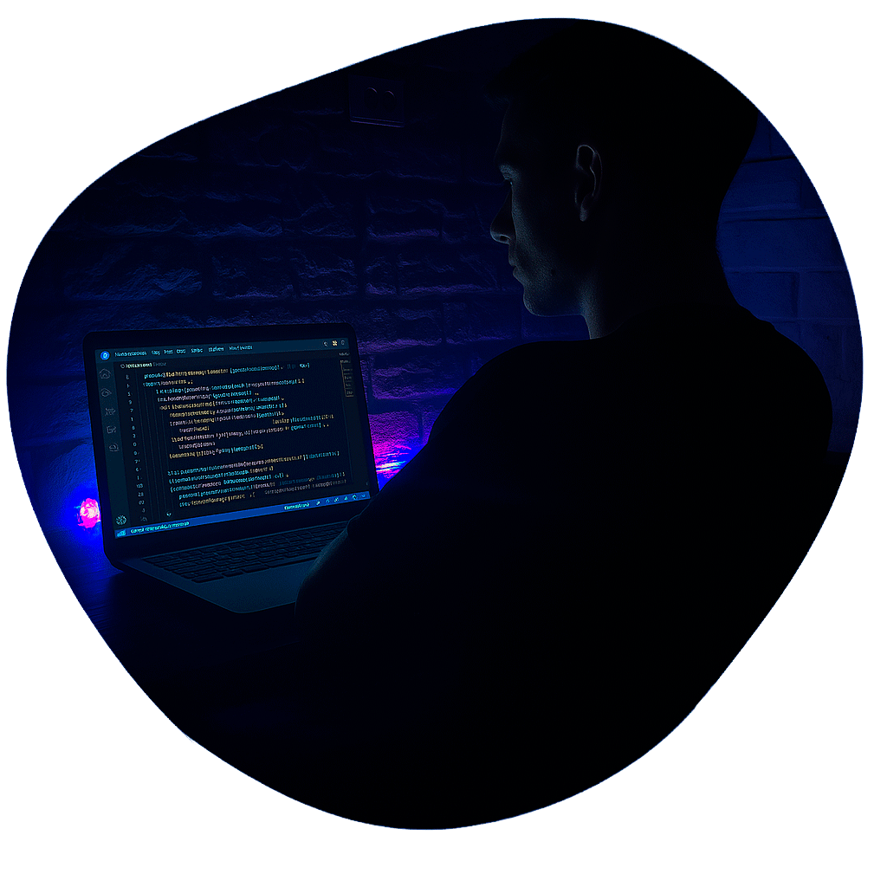

Portfólio Lucas Emanuel

<div align="center">
  
  
  **Desenvolvedor Front-end Júnior**
  
  [](https://www.linkedin.com/in/lucas-emanuel-837655307/)
  [](https://github.com/Lucasemanuel62)
  [](https://wa.me/5581985169176)
</div>

---

## 📋 Sobre o Projeto

Este é o portfólio pessoal de **Lucas Emanuel**, estudante de Análise e Desenvolvimento de Sistemas, especializado em desenvolvimento front-end. O site apresenta uma interface moderna, responsiva e otimizada para proporcionar a melhor experiência ao usuário.

### ✨ Características Principais

- 🎨 **Design Moderno**: Interface limpa e profissional
- 📱 **Totalmente Responsivo**: Adaptado para desktop, tablet e mobile
- ⚡ **Performance Otimizada**: Carregamento rápido e suave
- ♿ **Acessível**: Seguindo boas práticas de acessibilidade
- 🔧 **Código Organizado**: CSS modular e bem estruturado

---

## 🛠️ Tecnologias Utilizadas

### Frontend
- **HTML5** - Estrutura semântica
- **CSS3** - Estilização avançada com Flexbox e Grid
- **JavaScript** - Interatividade e funcionalidades

### Frameworks & Bibliotecas
- **React** - Desenvolvimento de componentes
- **Next.js** - Framework React para produção
- **Tailwind CSS** - Framework CSS utilitário

### Ferramentas
- **Git** - Controle de versão
- **GitHub** - Repositório e colaboração
- **Font Awesome** - Ícones vetoriais
- **Google Fonts** - Tipografia (Poppins, Ranchers)

---

## 📁 Estrutura do Projeto

```
portifolio/
├── css/
│   ├── base.css          # Reset e estilos globais
│   ├── header.css        # Navegação e menu mobile
│   ├── sections.css      # Páginas principais
│   ├── skills.css        # Seção de habilidades
│   ├── projects.css      # Seção de projetos
│   ├── footer.css        # Rodapé
│   ├── responsive.css    # Media queries
│   └── animations.css    # Animações
├── img/
│   ├── lucasfixa.webp    # Foto pessoal
│   ├── *.svg            # Ícones das tecnologias
│   └── *.png            # Imagens dos projetos
├── js/
│   └── script.js        # JavaScript principal
├── videos/
│   └── planetas.mp4     # Vídeo de fundo
├── index.html           # Página principal
└── README.md           # Documentação
```

---

## 🚀 Como Executar

### Pré-requisitos
- Navegador web moderno (Chrome, Firefox, Safari, Edge)
- Servidor local (opcional, para desenvolvimento)

### Instalação

1. **Clone o repositório**
   ```bash
   git clone https://github.com/Lucasemanuel62/portifolio.git
   ```

2. **Navegue até o diretório**
   ```bash
   cd portifolio
   ```

3. **Abra o arquivo index.html**
   - Opção 1: Clique duplo no arquivo `index.html`
   - Opção 2: Use um servidor local:
     ```bash
     # Com Python
     python -m http.server 8000
     
     # Com Node.js
     npx serve .
     
     # Com Live Server (VS Code)
     # Instale a extensão Live Server e clique em "Go Live"
     ```

4. **Acesse no navegador**
   - Local: `http://localhost:8000`
   - Ou abra diretamente o arquivo HTML

---

## 📱 Responsividade

O portfólio foi desenvolvido com **mobile-first** e se adapta perfeitamente a:

- 📱 **Mobile**: 320px - 700px
- 📟 **Tablet**: 700px - 1024px  
- 💻 **Desktop**: 1024px+

### Breakpoints Principais
```css
/* Mobile */
@media (max-width: 700px) { ... }

/* Tablet */
@media (min-width: 700px) and (max-width: 1024px) { ... }
```

---

## 🎯 Funcionalidades

### 🏠 Página Inicial
- Apresentação pessoal
- Foto profissional
- Botão de contato direto

### 💼 Seção de Habilidades
- Grid responsivo de tecnologias
- Ícones animados
- Hover effects suaves

### 📚 Seção "Sobre"
- Carrossel interativo
- Informações pessoais
- Qualidades profissionais

### 🚀 Projetos
- Grid de projetos desenvolvidos
- Overlays informativos
- Links para projetos reais
- Tecnologias utilizadas

### 📞 Contato
- Links para redes sociais
- WhatsApp direto
- Email de contato

---

## 🎨 Design System

### Paleta de Cores
- **Primária**: `#010B38` (Azul escuro)
- **Secundária**: `#01082b` (Azul mais escuro)
- **Acentos**: 
  - `#f99810` (Laranja)
  - `#ff6b6b` (Vermelho coral)
  - `#667eea` (Azul claro)
  - `#764ba2` (Roxo)

### Tipografia
- **Principal**: Poppins (Google Fonts)
- **Logo**: Ranchers (Google Fonts)
- **Tamanhos**: Sistema escalável com `clamp()`

### Componentes
- **Botões**: Gradientes com hover effects
- **Cards**: Sombras e elevação
- **Navegação**: Menu hambúrguer animado
- **Carrossel**: Scroll suave com snap

---

## ⚡ Performance

### Otimizações Implementadas
- ✅ **CSS Modular**: Carregamento otimizado
- ✅ **Imagens WebP**: Formato moderno e leve
- ✅ **Lazy Loading**: Carregamento sob demanda
- ✅ **Minificação**: Código otimizado
- ✅ **Cache**: Headers apropriados

### Métricas
- 🟢 **Lighthouse Score**: 90+
- 🟢 **Core Web Vitals**: Otimizado
- 🟢 **Mobile Friendly**: 100%

---

## 🔧 Desenvolvimento

### Estrutura CSS Modular
O CSS foi dividido em arquivos especializados para facilitar manutenção:

- **`base.css`**: Reset, variáveis globais, animações
- **`header.css`**: Navegação, logo, menu mobile
- **`sections.css`**: Layout das páginas principais
- **`skills.css`**: Seção de habilidades
- **`projects.css`**: Galeria de projetos
- **`footer.css`**: Rodapé e links sociais
- **`responsive.css`**: Media queries
- **`animations.css`**: Animações e transições

### Convenções de Código
- **BEM**: Metodologia de nomenclatura CSS
- **Mobile First**: Desenvolvimento responsivo
- **Semantic HTML**: Estrutura acessível
- **Clean Code**: Código limpo e comentado

---

## 📈 Roadmap

### 🎯 Próximas Funcionalidades
- [ ] **Dark Mode**: Tema escuro/claro
- [ ] **Blog**: Seção de artigos técnicos
- [ ] **Testimonials**: Depoimentos de clientes
- [ ] **Contact Form**: Formulário de contato
- [ ] **Analytics**: Métricas de visitantes
- [ ] **PWA**: Aplicativo web progressivo

---

## 📞 Contato

**Lucas Emanuel**  
📧 **Email**: lucasssantana62@outlook.com  
📱 **WhatsApp**: [+55 81 98516-9176](https://wa.me/5581985169176)  
💼 **LinkedIn**: [lucas-emanuel-837655307](https://www.linkedin.com/in/lucas-emanuel-837655307/)  
🐙 **GitHub**: [Lucasemanuel62](https://github.com/Lucasemanuel62)  
📍 **Localização**: São Gonçalo, RJ - Brasil

---

## 📄 Licença

Este projeto está sob a licença **MIT**. Veja o arquivo [LICENSE](LICENSE) para mais detalhes.

---

